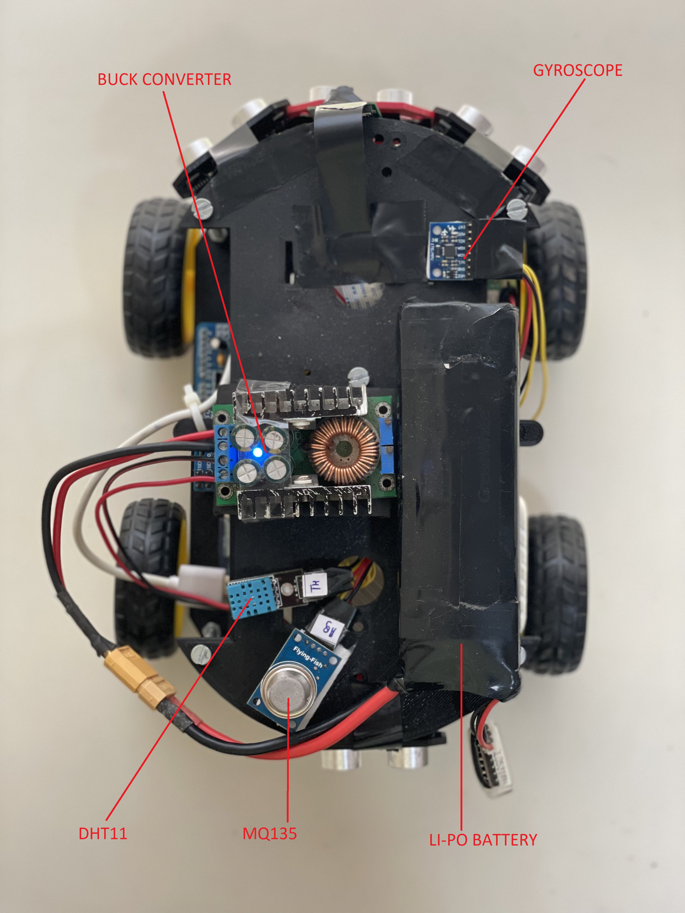
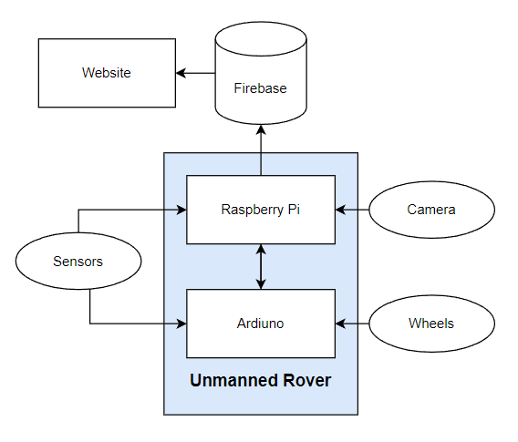

# IoT Unmanned Ground Vehicle (UGV)

An advanced Internet of Things (IoT) based Unmanned Ground Vehicle designed for remote surveillance, environmental monitoring, and semi-autonomous navigation.



## 📌 Project Overview

This project focuses on building a versatile UGV that can be controlled remotely via a web interface. It integrates multiple sensors to monitor environmental conditions and provide real-time feedback to the operator. The system leverages the combined power of a Raspberry Pi for high-level processing and connectivity, and an Arduino Uno for low-level motor control.

### Key Features
- **Remote Web Control:** Navigate the rover from any device on the same network using a responsive web dashboard.
- **Live Video Streaming:** Real-time first-person view (FPV) feed from the on-board Pi Camera.
- **Real-time Data Monitoring:** Live telemetry for Air Quality (AQI), Temperature, Humidity, and Distance from obstacles.
- **Cloud Integration:** Sensor data is synchronized with Google Firebase for real-time updates and historical analysis.
- **Semi-Autonomous Mode:** Built-in obstacle avoidance using ultrasonic sensors to navigate complex environments independently.
- **Data Visualization:** Interactive graphs using Plotly to track sensor trends over time.

---

## 🏗️ System Architecture

The project uses a serialized communication architecture between the Raspberry Pi and Arduino Uno.



1.  **Web Controller:** A web-based interface that sends control commands to Firebase.
2.  **Raspberry Pi:** The "brain" of the UGV. It listens to Firebase for commands, processes sensor data, manages the live stream, and communicates with the Arduino.
3.  **Arduino Uno:** The "muscle" of the UGV. It receives serial commands from the Pi to drive the DC motors via a motor shield.
4.  **Firebase:** Acts as the real-time bridge between the web interface and the physical rover.

---

## 🛠️ Hardware Requirements

| Component | Purpose |
| :--- | :--- |
| **Raspberry Pi** | Main processor, Wi-Fi connectivity, Camera interface |
| **Arduino Uno** | Motor control and low-level hardware abstraction |
| **Pi Camera Module** | Live video streaming |
| **HC-SR04 (x3)** | Ultrasonic sensors for obstacle avoidance |
| **MPU6050** | Gyroscope and Accelerometer for road quality assessment |
| **DHT11** | Temperature and Humidity monitoring |
| **MQ135** | Air Quality (Gas) sensor |
| **L298N Shield** | Motor driver for 4-wheel drive |
| **DC Motors (x4)** | Propulsion |
| **LiPo Battery** | Main power source |
| **Buck Converter** | Voltage regulation |
| **3D Printed Frame** | Chassis for mounting components |

---

## 💻 Software Dependencies

### Raspberry Pi (Python)
- `firebase-admin`: For Firebase RTDB integration.
- `picamera`: For camera module control.
- `pyserial`: For communication with Arduino.
- `Adafruit_DHT`: For DHT11 sensor reading.
- `mpu6050-raspberrypi`: For MPU6050 integration.

### Web Interface
- `Firebase JS SDK`: Real-time data synchronization.
- `Plotly.js`: For live graphing and visualization.
- `FontAwesome`: For UI icons.

### Arduino
- `Arduino IDE` for flashing the controller.

---

## 📂 Directory Structure

```text
├── assets/             # Images, diagrams, and UI assets
├── docs/               # Research papers, reports, and project documentation
├── hardware/           # Arduino (.ino) source code for motor control
├── software/
│   └── pi/             # Python scripts for Raspberry Pi integration
└── web/                # Web controller (HTML, CSS, JS)
```

---

## 🚀 Getting Started

### 1. Arduino Setup
1.  Connect the Arduino Uno to your PC.
2.  Open `hardware/rover_arduino.ino` in the Arduino IDE.
3.  Ensure you have the necessary motor shield libraries installed.
4.  Upload the code to the Arduino.

### 2. Raspberry Pi Setup
1.  Connect the sensors and camera to the Pi as per the design diagrams in `docs/`.
2.  Connect the Pi and Arduino via USB.
3.  Install dependencies:
    ```bash
    pip install firebase-admin picamera pyserial Adafruit_DHT mpu6050-raspberrypi
    ```
4.  Place your Firebase service account JSON key in the `software/pi/` directory and update the path in `integrated_controller.py`.
5.  Run the controller script:
    ```bash
    python software/pi/integrated_controller.py
    ```

### 3. Web Controller Setup
1.  The web interface is client-side. You can host the `web/` directory on any web server or simply open `web/index.html` in a browser.
2.  Ensure your Firebase configuration in `web/index.html` matches your project settings.

---

## 👥 Contributors

- **Vrushit Patel** (E006)
- **Dhruv Pathak** (E008)
- **Shivansh Sharma** (E027)
- **Shrey Thapar** (E049)

*MPSTME, NMIMS University*

---

## 📄 License & Documentation

Detailed project reports, research papers, and logbooks can be found in the [docs/](docs/) directory.
